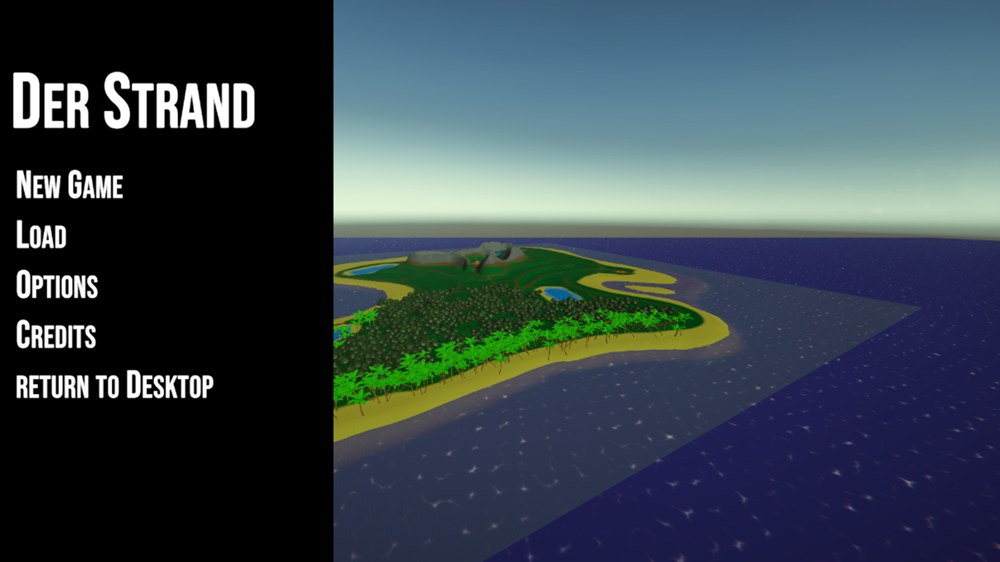
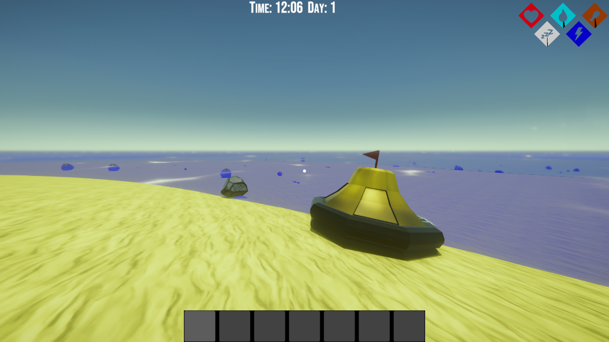
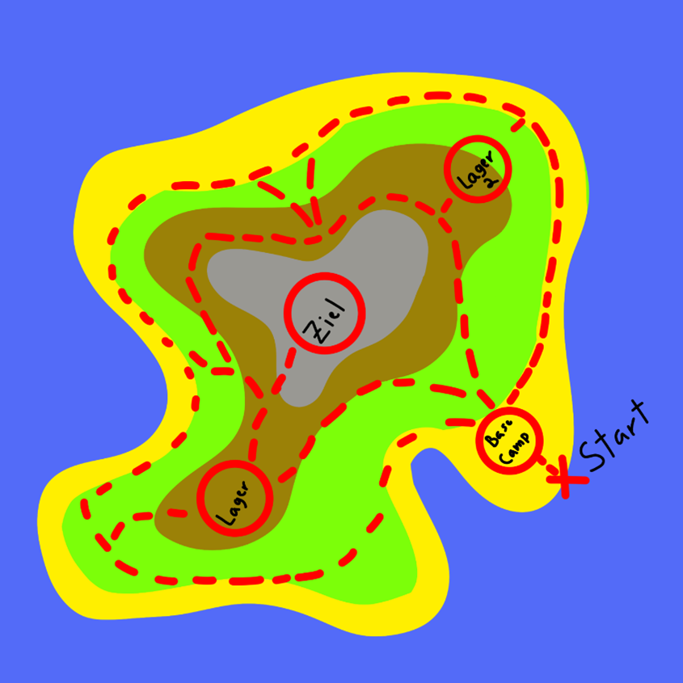
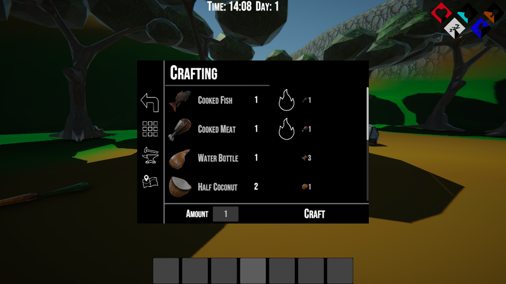
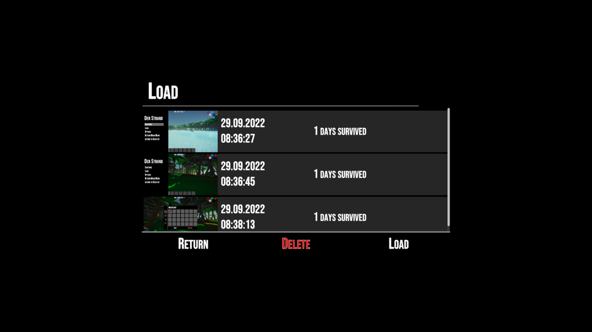
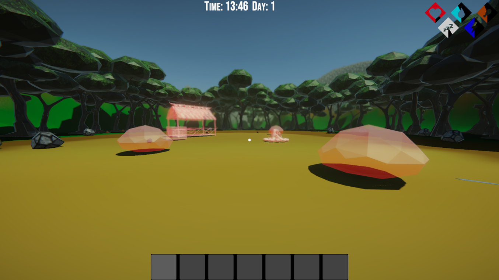
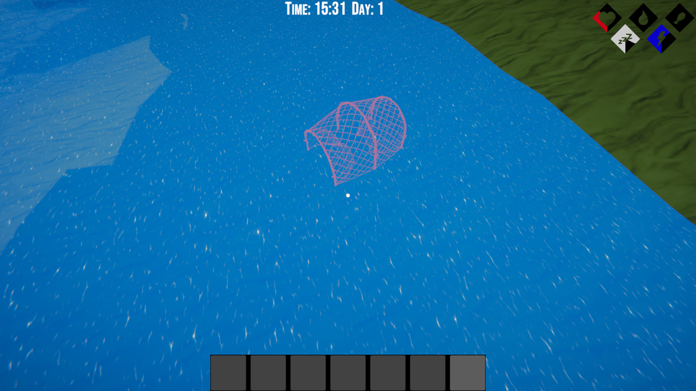
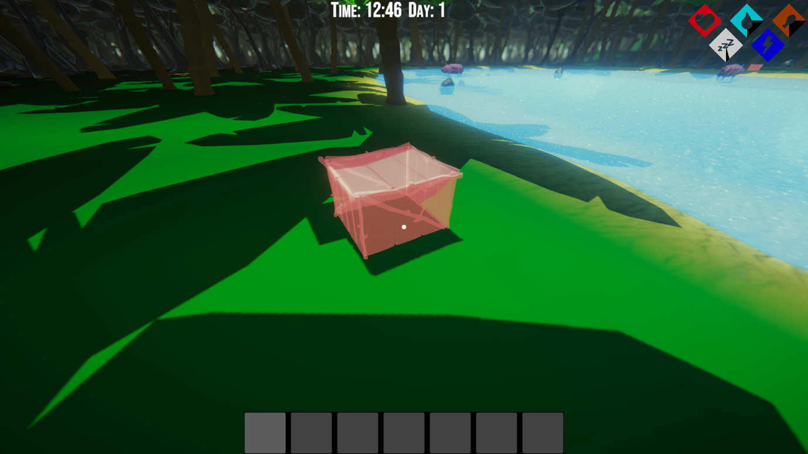

# DerStrand

## Game Genre
Survival

## Target Audience
FSK 12

## Game-Engine
Unity

## Controls
- **WASD:** Movement
- **Mouse:** Look around
- **Space:** Jump
- **Left Shift:** Sprint
- **Tab:** In-Game Guide
- **E:** Interact
- **E (Hold):** Move Objects
- **Left Mouse Button:** Use Item in Hand
- **Scroll Wheel:** Change Item in Hand
- **Escape:** Pause Menu

## Hints
- Player must watch his hunger, thirst and sleep. When one of those is empty, life is drained from its HP. HP loss increases when hungry, thirsty and/or tired.
- It is best to find a camping area and build a hut to sleep and save the game.
- Game saves ONLY when the player is sleeping. Upon dying, the player will lose their progress since the last save.

## Description
You take on the role of a shipwrecked man. Since he doesn't know the island, he must first explore it, avoid enemies or fight them. Furthermore, he has to survive on a wild island, so he has to act carefully because something could be lurking around every corner, and he has to learn to build important things to survive. This requires creativity and logic. Survival and escape from the island is the goal of the game. After finding the flare gun, fire it from the highest mountain, which will save you.

### Map Sketch of the Island

### Objects in the Game
| Animal    | Items                | Plants     | Food     |
|-----------|----------------------|------------|----------|
| Chicken   | Axe                  | Trees      | Potatoes |
| Wild boar | Speer                | Bushes     | Carrots  |
| Pig       | Knife                | Berry Bush | Berries  |
| Fish      | Arrows               | Grass      | Meat     |
| Shark     | Bow                  | Potatoes   | Fish     |
| Turtle    | Torch                | Carrots    | Water    |
| Fish      | Flint                |            |          |
|           | rock                 |            |          |
|           | Pot                  |            |          |
|           | Level 1 Bed          |            |          |
|           | Level 2 Bed          |            |          |
|           | Level 3 Bed          |            |          |
|           | Campfire             |            |          |
|           | Crates               |            |          |
|           | Planting Container   |            |          |
|           | Raw Meat             |            |          |
|           | Raw Fish             |            |          |
|           | Berries              |            |          |
|           | Bones                |            |          |
|           | Potatoes             |            |          |
|           | Carrots              |            |          |
|           | Coconuts             |            |          |
|           | Leather Water Bottle |            |          |
|           | Animal Trap          |            |          |
|           | Fish Trap            |            |          |
|           | Fur                  |            |          |
|           | Leather              |            |          |
|           | Liana                |            |          |
|           | Sticks               |            |          |
|           | Leaves               |            |          |
|           | Turtle Shell         |            |          |
|           | Feather              |            |          |
|           | Logs                 |            |          |
|           | Resin                |            |          |
|           | Planks               |            |          |

| Components                         | Crafting Ingredients |
|------------------------------------|----------------------|
| V1 Bed palm leaves on floor        | Stones               |
| V2 Bed (Tent) or (Hammock)         | Sticks               |
| V3 Bed Animal Fur Bed              | Fur                  |
| Water Collector (rain)             | Animal Fat           |
| Campfire (Small)                   | Leather              |
| Campfire (Large - Cooking Station) | Liana                |
| Crates                             | Flint                |
| Planting Containers                | Feather              |
| Compost Bin                        | Fur                  |
| House                              | Turtle Shell         |
| Hut                                | Half Coconut         |
| Water Containers                   | Dirt                 |
| Smoking Station                    |                      |

### Inventory and Crafting
You can gather resources from the environment to craft important tools and food. On the crafting page, you can see the resources required for each item and whether it can be crafted.

### Save and Load
In the game, you can save your progress in the camp area and load the game in the main menu. It also shows the number of surviving days and the date of the Save.

### Camp Area
There are fixed bases to build on. There are also berry bushes from which you get berries at random intervals. In the camping area, you can cook raw food (in the crafting menu). In the hut, you can save the game and sleep.

### Animal and Fish Traps
In the game, there are fixed places for animal and fish traps that you can build with certain resources. After a random time, something will be caught.

## Credits
- **Programming / UX:** [Tariq Alsalem](https://github.com/ShadierPond)
- **Programming / Level Design:** [Sandro Herberich](https://github.com/Cur1o)
- **Programming:** [Anastasia Naumann](https://github.com/ElPatronWhizzKey)
- **Programming / AI:** [Stefan Laufer](https://github.com/DerRitterRost)
- **3D Modelling / Texturing / Animation:** Roman Heinze
- **3D Modelling / Texturing / Animation:** Tom Boening
